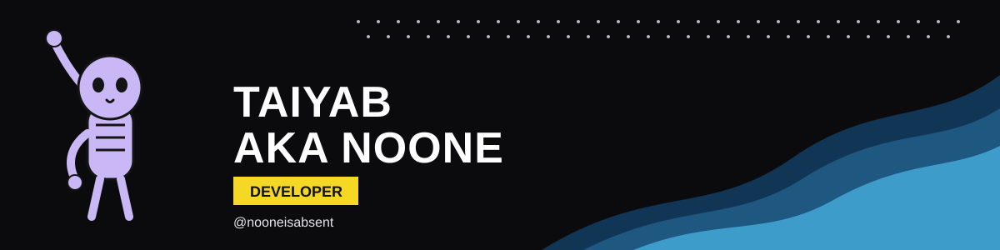
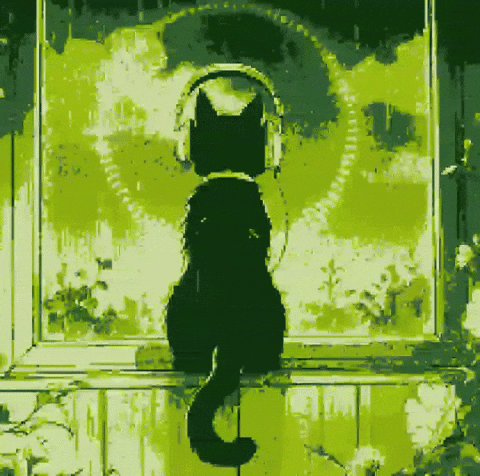

  

  

  
  
  

<table>
<tr>
<td width="60%" valign="top">

## 💫 About Me

A very questionable indie game developer building apps and games that probably shouldn't exist, but do.

- 🎮 **I ABSOLUTELY LOVE making video games**: Unreal, Unity, and whatever engine I'm fighting this week
- 📱 Flutter for cross-platform apps, Firebase for backend-as-a-service, Node.js/Express when I want control
- 🧠 Occasionally fall into AI/ML, graphics, and system architecture rabbit holes at 2AM
- 🗂️ Known for starting too many projects and somehow finishing a few (rarely)
- 🤝 Social skills: under development. Debugging skills: production-ready.

### 🔭 Currently

- 🌍 Building worlds in **Unreal Engine**
- 📱 Shipping apps with **Flutter**
- 🎨 Digging into **graphics programming** (OpenGL / WebGL)

</td>
<td width="40%" align="center" valign="middle">

</td>
</tr>
</table>

## 🌐 Socials

## 💻 Tech Stack

**🎮 Game Dev & Graphics** 

**⌨️ Languages** 

**📱 App & Web** 

**🗄️ Backend & Cloud** 

**🎨 Design, Media & Tools** 

## 📊 GitHub Stats

  
  

  

  

## 🏆 GitHub Trophies

  

## 🐍 Contribution Snake

  

---

  <i>Starting too many projects since forever. Shipping a few anyway.</i> 🎮

  

<!-- Proudly created with GPRM ( https://gprm.itsvg.in ) -->
